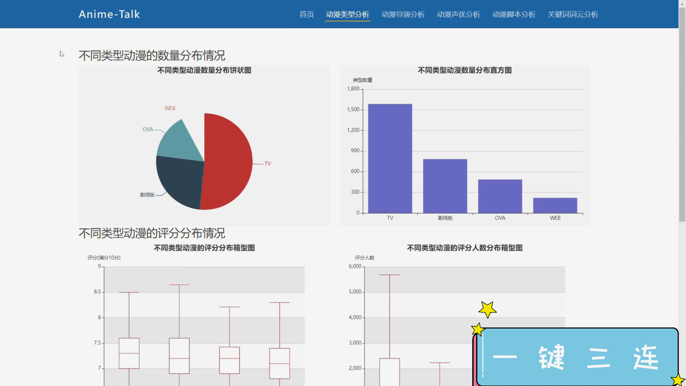
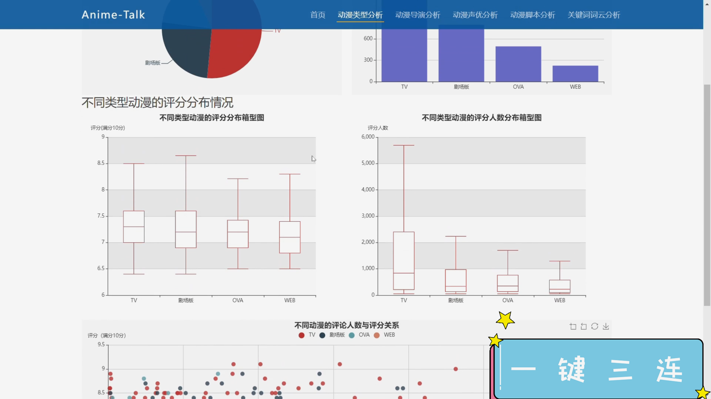
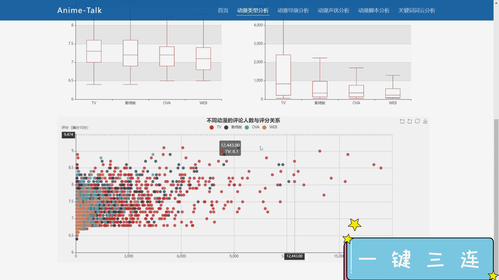
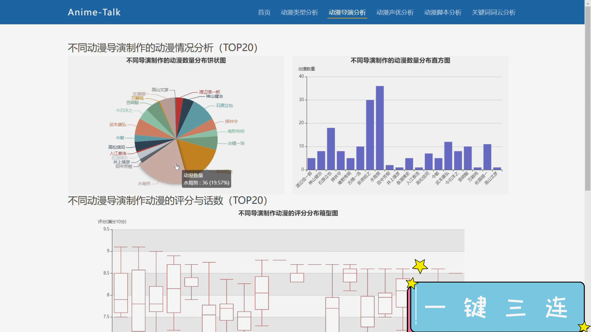
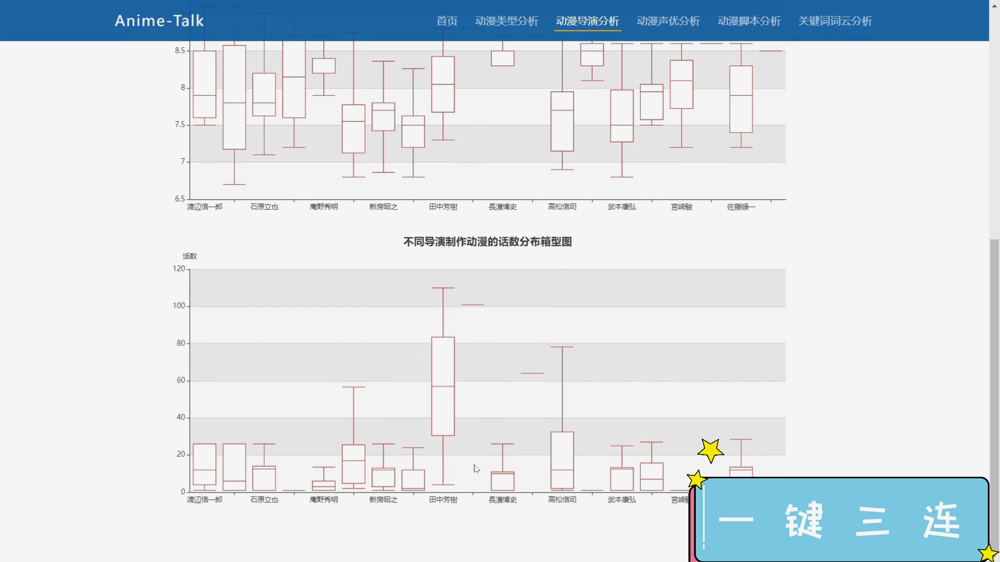

## 计算机毕业设计Python动漫视频分析可视化 动漫影视可视化 动漫情感分析 动漫爬虫 机器学习 深度学习 Tensorflow PyTorch LSTM模型

## 要求
### 源码有偿！一套(论文 PPT 源码+sql脚本+教程)

### 
### 加好友前帮忙start一下，并备注github有偿纯python动漫25
### 我的QQ号是2827724252或者798059319或者 1679232425或者微信:bysj2023nb 或bysj1688

# 

### 加qq好友说明（被部分 网友整得心力交瘁）：
    1.加好友务必按照格式备注
    2.避免浪费各自的时间！
    3.当“客服”不容易，repo 主是体面人，不爆粗，性格好，文明人。
## 介绍
基于Python的B站排行榜大数据分析与可视化系统通过网络爬虫技术，自动采集B站网址热门排行榜，提取大量相关文本信息并存储在系统中。通过对这些信息进行统计分析，系统实现了B站排行榜热度的整体分析，热门版块的词云分析以及不同版块热度的详细分析。通过可视化的方式，用户可以清晰直观地了解B站各个排行榜的动态和热度趋势。本系统不仅提供了对B站内容的全面分析，还为用户提供了一种方便、直观的方式来探索和了解B站平台上的热门内容和趋势。

## 演示视频
https://www.bilibili.com/video/BV1eAmAYsEcp/

https://www.bilibili.com/video/BV1ecmAYdExr/

## 截图

